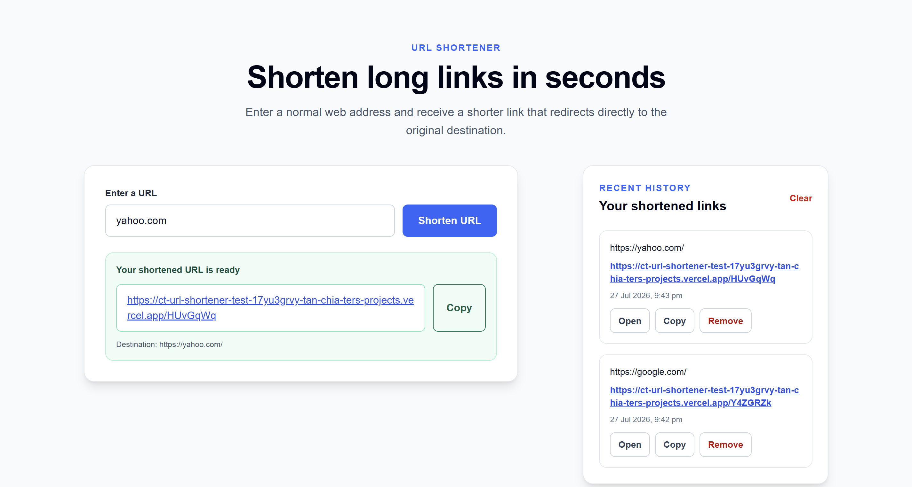
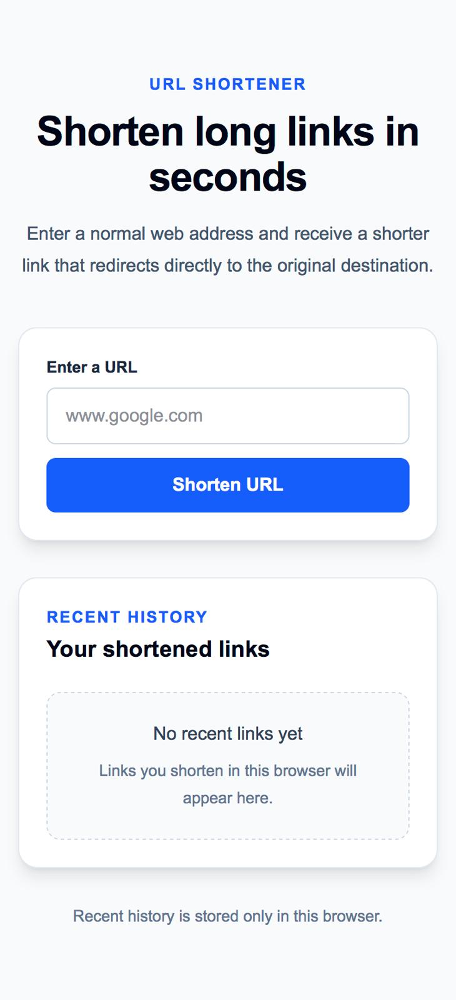

# CT URL Shortener

A full-stack URL-shortening application built with Next.js, TypeScript, MySQL, Prisma, React Hook Form, and Jest.

The application accepts a normal web address and generates a shorter URL. Visiting the shortened URL redirects the browser directly to the original destination.

This project was created as a take-home software-engineering assessment.

---

## Live Application

The public deployment URL will be added after deployment.

```text
https://ct-url-shortener-test.vercel.app/
```

## Repository

```text
https://github.com/chiater0311/ct-url-shortener-test
```

## Preview

### Desktop



### Mobile

## 

## Features

### Core functionality

- Shorten a normal HTTP or HTTPS URL
- Automatically add `https://` when the submitted URL has no protocol
- Generate a random seven-character alphanumeric short code
- Persist shortened URLs in MySQL
- Redirect shortened URLs directly to their original destinations
- Return an existing short URL when the same normalized URL is submitted again
- Display a custom 404 page for unknown short codes

### User interface

- Responsive URL-shortening form
- Form handling and client-side validation with React Hook Form
- Loading state while a URL is being shortened
- Clear validation and server-error messages
- Copy shortened URLs to the clipboard
- Open generated shortened URLs in a new browser tab
- Browser-specific recent-history panel
- Remove individual entries from recent history
- Clear all recent browser history
- Responsive desktop and mobile layouts

### Engineering practices

- Layered route, service, repository, and utility structure
- TypeScript across frontend and backend code
- Prisma schema and migration management
- Managed MySQL-compatible production database support
- Jest unit tests
- Jest service tests with repository methods mocked using spies
- ESLint checks
- Production build verification
- Centralized server-side environment configuration
- Automatic Prisma Client generation after dependency installation

---

## Technology Stack

### Application

- Next.js 16
- React 19
- TypeScript
- Node.js 24

### Frontend

- Next.js App Router
- React Hook Form
- Tailwind CSS
- Browser `localStorage`

### Backend

- Next.js Route Handlers
- Next.js Server Components
- Prisma ORM
- MySQL

### Testing and quality

- Jest
- jsdom for browser-storage tests
- ESLint
- TypeScript compiler checks through the Next.js build

### Deployment

- Vercel for application hosting
- Aiven for managed MySQL hosting

---

## How It Works

### Shortening a URL

```text
User enters a URL
        ↓
React Hook Form submits the request
        ↓
POST /api/urls
        ↓
Route handler validates the request body
        ↓
URL shortener service normalizes the URL
        ↓
Repository checks for an existing record
        ↓
Service generates a unique short code when needed
        ↓
Repository saves the record through Prisma
        ↓
MySQL persists the shortened URL
        ↓
API returns the generated short URL
        ↓
Frontend displays and stores it in browser history
```

### Redirecting a shortened URL

```text
User visits /[shortCode]
        ↓
Next.js reads the dynamic route parameter
        ↓
Service looks up the short code
        ↓
Repository queries MySQL through Prisma
        ↓
Record found
        ↓
Browser redirects to the original URL
```

When the short code does not exist, the application displays a custom 404 page.

---

## Architecture

The project uses a layered architecture:

```text
Route or page
      ↓
Service
      ↓
Repository
      ↓
Prisma Client
      ↓
MySQL
```

### Route and page layer

Responsible for:

- Reading HTTP request data
- Validating request shapes
- Selecting HTTP status codes
- Returning JSON responses
- Reading route parameters
- Triggering redirects
- Rendering error and not-found pages

### Service layer

Responsible for:

- URL normalization
- URL validation
- Duplicate URL handling
- Short-code generation
- Collision retry logic
- Coordinating repository operations

### Repository layer

Responsible for:

- Prisma database queries
- Looking up records by original URL
- Looking up records by short code
- Creating shortened URL records

### Utility layer

Responsible for:

- Prisma Client initialization
- Environment configuration
- URL parsing and validation
- Random short-code generation
- Browser-history storage operations

This separation keeps route handlers small and makes the core business logic easier to test, understand, and modify.

---

## Project Structure

```text
.
├── prisma/
│   ├── migrations/
│   └── schema.prisma
│
├── public/
│
├── src/
│   ├── app/
│   │   ├── [shortCode]/
│   │   │   └── page.tsx
│   │   │
│   │   ├── api/
│   │   │   └── urls/
│   │   │       └── route.ts
│   │   │
│   │   ├── error.tsx
│   │   ├── favicon.ico
│   │   ├── globals.css
│   │   ├── layout.tsx
│   │   ├── not-found.tsx
│   │   └── page.tsx
│   │
│   ├── components/
│   │   ├── url-history.tsx
│   │   ├── url-shortener-dashboard.tsx
│   │   └── url-shortener-form.tsx
│   │
│   ├── generated/
│   │   └── prisma/
│   │
│   ├── lib/
│   │   ├── env.ts
│   │   ├── prisma.ts
│   │   ├── short-code.ts
│   │   ├── url-history-storage.ts
│   │   └── url.ts
│   │
│   ├── repositories/
│   │   └── short-url.repository.ts
│   │
│   ├── services/
│   │   └── url-shortener.service.ts
│   │
│   ├── tests/
│   │   ├── short-code.test.ts
│   │   ├── url-history-storage.test.ts
│   │   ├── url-shortener.service.test.ts
│   │   └── url.test.ts
│   │
│   └── types/
│       └── url.ts
│
├── .env.example
├── .gitignore
├── .nvmrc
├── eslint.config.mjs
├── jest.config.ts
├── next.config.ts
├── package.json
├── package-lock.json
├── postcss.config.mjs
├── README.md
└── tsconfig.json
```

---

## Database Schema

The application uses one primary database table.

```prisma
model ShortUrl {
  id          Int      @id @default(autoincrement())
  shortCode   String   @unique @db.VarChar(10)
  originalUrl String   @db.Text
  createdAt   DateTime @default(now())
  updatedAt   DateTime @updatedAt

  @@map("short_urls")
}
```

### Fields

| Field         | Description                               |
| ------------- | ----------------------------------------- |
| `id`          | Internal auto-incrementing primary key    |
| `shortCode`   | Unique code included in the shortened URL |
| `originalUrl` | Normalized destination URL                |
| `createdAt`   | Record creation timestamp                 |
| `updatedAt`   | Record update timestamp                   |

Example:

```text
id:          1
shortCode:   aZ7kP2x
originalUrl: https://www.google.com/
createdAt:   2026-07-27 10:30:00
updatedAt:   2026-07-27 10:30:00
```

The short code has a unique database constraint so two records cannot use the same redirect path.

---

## URL Normalization and Validation

The application accepts both complete URLs and common URLs without an explicit protocol.

Input:

```text
www.google.com
```

Normalized value:

```text
https://www.google.com/
```

Input:

```text
https://www.wikipedia.org/wiki/URL_shortening
```

Normalized value:

```text
https://www.wikipedia.org/wiki/URL_shortening
```

The application accepts only:

```text
http://
https://
```

Examples of rejected values include:

```text
Empty input
Malformed URLs
javascript: URLs
ftp: URLs
Values without a valid hostname
```

The frontend provides basic form validation for immediate feedback, while the backend remains the source of truth for URL validation.

---

## Short-Code Generation

Short codes use the following character set:

```text
0123456789abcdefghijklmnopqrstuvwxyzABCDEFGHIJKLMNOPQRSTUVWXYZ
```

The default code length is:

```text
7 characters
```

Example:

```text
aZ7kP2x
```

The application uses Node.js cryptographic random generation instead of `Math.random()`.

The creation process is:

```text
Generate random code
        ↓
Check whether the code already exists
        ↓
Available → create database record
Collision → generate another code
```

The service retries a limited number of times to prevent an infinite loop.

The database unique constraint provides a final safeguard against duplicate short codes.

---

## Duplicate URL Behaviour

When the same normalized URL is submitted again, the application returns its existing shortened URL instead of creating another database record.

Example:

```text
First submission:
www.google.com

Normalized:
https://www.google.com/

Generated:
https://example.vercel.app/aZ7kP2x
```

A later submission containing:

```text
https://www.google.com/
```

returns the same short code:

```text
aZ7kP2x
```

This avoids unnecessary duplicate records and provides deterministic behaviour.

Duplicate handling was not explicitly specified in the assessment, so this behaviour was selected as a documented design decision.

---

## Browser History

The recent-history panel uses browser `localStorage`.

Each history entry contains:

```text
shortCode
shortUrl
originalUrl
createdAt
```

### Behaviour

- The newest shortened URL appears first
- Duplicate short codes are moved to the top
- History is limited to the latest ten entries
- History remains after refreshing the page
- History remains after closing and reopening the browser
- Individual entries can be removed
- All recent history can be cleared
- History is specific to the current browser

### Important distinction

Removing or clearing browser history does not delete the database record.

```text
MySQL
→ persistent redirect records

localStorage
→ browser-specific recent-history display
```

A shortened URL will continue to redirect after it has been removed from browser history.

---

## API Reference

### Create or retrieve a shortened URL

```http
POST /api/urls
```

#### Request body

```json
{
  "url": "www.google.com"
}
```

### Newly created URL

Status:

```text
201 Created
```

Response:

```json
{
  "shortCode": "aZ7kP2x",
  "shortUrl": "http://localhost:3000/aZ7kP2x",
  "originalUrl": "https://www.google.com/"
}
```

### Existing URL

Status:

```text
200 OK
```

Response:

```json
{
  "shortCode": "aZ7kP2x",
  "shortUrl": "http://localhost:3000/aZ7kP2x",
  "originalUrl": "https://www.google.com/"
}
```

### Invalid request

Status:

```text
400 Bad Request
```

Example response:

```json
{
  "error": "Please enter a valid HTTP or HTTPS URL."
}
```

### Unexpected server error

Status:

```text
500 Internal Server Error
```

Response:

```json
{
  "error": "Unable to shorten the URL."
}
```

Internal database details and stack traces are not returned to the client.

---

### Redirect a shortened URL

```http
GET /:shortCode
```

Example:

```http
GET /aZ7kP2x
```

Existing code:

```text
307 Temporary Redirect
```

Unknown code:

```text
404 Not Found
```

A temporary redirect was selected because future requirements could allow destinations to be edited, disabled, or expired.

---

## Prerequisites

Install:

- Node.js 24
- npm
- Git
- MySQL

The project was developed using:

```text
Node.js v24.18.0
```

The recommended Node.js version is recorded in:

```text
.nvmrc
```

Recommended local tools:

- NVM or NVM for Windows
- Laragon
- HeidiSQL
- Visual Studio Code

---

## Local Setup

### 1. Clone the repository

```bash
git clone <https://github.com/chiater0311/ct-url-shortener-test.git>
cd ct-url-shortener-test
```

### 2. Use the expected Node.js version

With NVM:

```bash
nvm install 24.18.0
nvm use 24.18.0
```

Verify:

```bash
node --version
```

Expected:

```text
v24.18.0
```

### 3. Install dependencies

```bash
npm ci
```

The project includes:

```json
"postinstall": "prisma generate"
```

Therefore, Prisma Client is generated automatically after dependency installation.

### 4. Create the local environment file

PowerShell:

```powershell
Copy-Item .env.example .env
```

macOS or Linux:

```bash
cp .env.example .env
```

### 5. Configure the database values

Example `.env`:

```env
DATABASE_URL="mysql://root:@127.0.0.1:3306/ct_url_shortener"

DATABASE_HOST="127.0.0.1"
DATABASE_PORT="3306"
DATABASE_USER="root"
DATABASE_PASSWORD=""
DATABASE_NAME="ct_url_shortener"
```

Update these values according to your local MySQL configuration.

Never commit `.env`.

---

## Local MySQL Setup

Using Laragon and HeidiSQL:

1. Start MySQL through Laragon.
2. Open HeidiSQL.
3. Connect to the local MySQL server.
4. Create an empty database:

```text
ct_url_shortener
```

Recommended collation:

```text
utf8mb4_unicode_ci
```

Do not create the application tables manually.

Prisma migrations create and manage the table structure.

---

## Prisma Commands

### Generate Prisma Client

```bash
npx prisma generate
```

### Apply migrations locally

```bash
npx prisma migrate dev
```

This applies the committed migration files to the local development database.

Expected tables:

```text
_prisma_migrations
short_urls
```

### View database records

```bash
npx prisma studio
```

### Apply migrations in production

```bash
npm run db:migrate:deploy
```

This runs:

```bash
prisma migrate deploy
```

Do not use `prisma migrate dev` against the production database.

---

## Running the Application

Start the development server:

```bash
npm run dev
```

Open:

```text
http://localhost:3000
```

Stop the development server with:

```text
Ctrl + C
```

---

## Testing

Run the Jest test suite:

```bash
npm test
```

Run Jest in watch mode:

```bash
npm run test:watch
```

Generate a coverage report:

```bash
npm run test:coverage
```

### Test coverage

Tests cover:

- Adding HTTPS to URLs without protocols
- Preserving valid HTTP and HTTPS URLs
- Rejecting empty, malformed, or unsupported URLs
- Generating seven-character short codes
- Restricting short codes to alphanumeric characters
- Rejecting invalid custom code lengths passed to the generator
- Returning an existing record for a duplicate URL
- Creating a new record when the URL does not exist
- Avoiding database access in unit tests through repository spies
- Adding and reading browser history
- Ordering recent history
- Removing individual browser-history entries
- Clearing all browser history

### Testing approach

Pure utility functions are tested independently.

Service tests use Jest spies on repository methods:

```text
Service
    ↓
Spied repository methods
    ↓
Controlled test results
```

This keeps tests fast and prevents them from depending on a running MySQL database.

Browser-history tests use the Jest jsdom environment to provide `window.localStorage`.

---

## New Device Setup

```bash
git clone <YOUR_REPOSITORY_URL>
cd ct-url-shortener-test
nvm install 24.18.0
nvm use 24.18.0
npm ci
```

Then:

1. Copy `.env.example` to `.env`.
2. Configure local MySQL credentials.
3. Start MySQL.
4. Create the empty `ct_url_shortener` database.
5. Apply the committed migrations:

```bash
npx prisma migrate dev
```

6. Run the project checks:

```bash
npm test
npm run lint
npm run build
```

7. Start the application:

```bash
npm run dev
```

Do not create a new migration merely to configure another development device.

---

## Deployment

The intended production architecture is:

```text
Vercel
   ↓
Next.js application
   ↓
Prisma
   ↓
Aiven managed MySQL
```

## Design Decisions

### Next.js

Next.js allows the frontend, backend endpoints, redirect route, error pages, and deployment configuration to exist in one TypeScript project.

### TypeScript

TypeScript provides stronger contracts for:

- API responses
- Form values
- Component props
- Service results
- Repository methods
- Browser-history records

### MySQL

MySQL provides durable URL persistence across application and server restarts.

### Prisma

Prisma provides:

- Typed database operations
- Schema definition
- Migration history
- Prisma Client generation
- TypeScript integration

### Service layer

The service layer contains business logic rather than placing it directly in the API route.

This makes the application easier to test and modify during a pair-programming session.

### Repository layer

The repository isolates Prisma queries from application rules.

The service can coordinate behaviour without depending directly on Prisma query syntax.

### Jest

Jest is used for utility, browser-storage, and service tests.

### React Hook Form

React Hook Form manages form state, submission state, and field validation while minimizing manual state handling.

### Browser history in localStorage

Recent history is a browser convenience feature rather than core system data.

Using `localStorage` avoids introducing unnecessary authentication, user-account, or session-management requirements.

---

## Assumptions

1. Only HTTP and HTTPS URLs are supported.
2. URLs without protocols default to HTTPS.
3. Short codes are generated by the application.
4. Short codes contain seven alphanumeric characters.
5. Short codes are unique.
6. The same normalized URL returns its existing short code.
7. Shortened URLs do not expire.
8. Shortened URLs cannot be edited.
9. Shortened URLs cannot be deleted through the user interface.
10. Browser history is browser-specific.
11. Clearing browser history does not delete database records.
12. Authentication is not required.

---

## Security Considerations

- Database credentials are stored in environment variables.
- Real environment files are excluded from Git.
- Database environment variables remain server-side.
- Unsupported URL protocols are rejected.
- Database errors and stack traces are not returned to users.
- Short-code uniqueness is enforced in the service and database.
- Prisma queries are performed only on the server.
- The frontend cannot access database credentials.
- The application does not expose a database-delete endpoint.

This is a take-home assessment project and does not implement every control required for a large-scale public URL-shortening platform.

---

## Author

**Tan Chia Ter**

Built as part of a Singapore Tourism Board take-home software-engineering assessment.
